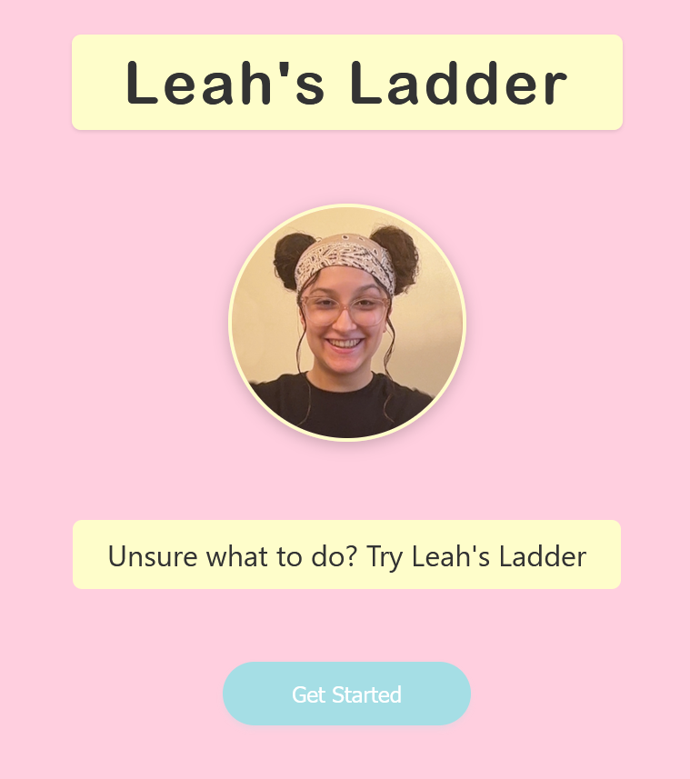

# Leah's Ladder

An easy game to make decisions simple. First select which categories you want to play with, then play a simple swiping game to eliminate any hard passes, then choose between two options to narrow down your final rankings.

The website has placeholder data, but it's really easy to add in your own! Just follow the directions on the website or below to make a CSV file and click upload.



## How to play
Just load the website at: [https://yeti-owner.github.io/leahs-ladder/](https://yeti-owner.github.io/leahs-ladder/) and follow the directions! If you'd like to run it locally, just download, then run:

```bash
npm install
npm run dev
```

### Custom Options

You can replace the placeholder entries with your own options by uploading a CSV file to the home page.

Create a `.csv` file in this format:
```csv
title,description,image,tags
Minecraft,Build a new house,https://minecraft.com/minecraft.png,games
Breaking Bad,Watch the next episode,https://movie.com/breakingbad.jpg,shows
Inception,Watch this,https://inception.com/inception.jpg,movies
My Neighbor Totoro,Re-watch my favorite Ghibli,https://ghibli.com/totoro.jpg,movies|anime
```

Here's what each column means:

| Column | Description |
|-|-|
| `title` | Name of the option, ie "Minecraft" |
| `description` | Short description shown on the card, ie "Play Hypixel" |
| `image` | Link to an image (any link online) ie "https://example.com/image.png"|
| `tags` | What categories it is, can be multiple if you separate it with `|` ie "games\|coop"|

---

**Created with love for Leah**